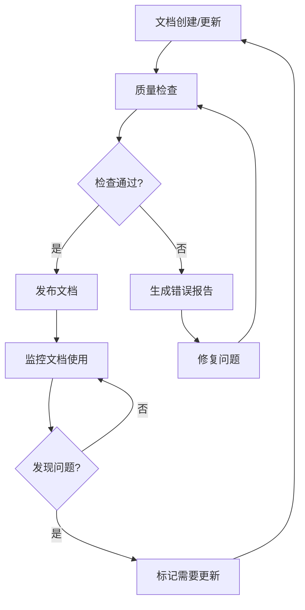

# 项目文档规范设计文档

## 概述

本设计文档基于 unibest 框架的 uniapp 项目，旨在创建一套完整、结构化的项目文档体系。该文档体系将涵盖项目的技术架构、开发规范、API使用、组件库集成等各个方面，并特别针对 AI 辅助编码场景进行优化，确保开发者能够通过 @ 符号快速获取相关上下文。

## 架构

### 文档架构设计

```
docs/
├── 01-project-overview.md          # 项目概览
├── 02-tech-stack.md               # 技术栈详解
├── 03-development-guide.md         # 开发指南
├── 04-api-and-services.md          # API和服务
├── 05-components-and-ui.md         # 组件和UI库
├── 06-utils-and-hooks.md           # 工具函数和Hooks
├── 07-build-and-deployment.md      # 构建和部署
├── 08-coding-standards.md          # 编码规范
├── 09-troubleshooting.md           # 常见问题
└── 10-ai-integration.md            # AI辅助编码集成
```

### 文档内容层次结构

每个文档将采用以下层次结构：
1. **概述** - 简要说明该模块的作用和重要性
2. **核心概念** - 关键概念和术语解释
3. **使用指南** - 详细的使用方法和最佳实践
4. **API参考** - 完整的API文档（如适用）
5. **示例代码** - 实际的代码示例和用例
6. **注意事项** - 重要提醒和常见陷阱
7. **相关资源** - 外部文档链接和参考资料

## 组件和接口

### 文档模板组件

#### 标准文档模板
```markdown
# [模块名称]

## 概述
[简要描述模块功能和用途]

## 核心概念
[关键概念解释]

## 使用指南
[详细使用方法]

## API参考
[API文档]

## 示例代码
[代码示例]

## 注意事项
[重要提醒]

## 相关资源
[外部链接]
```

#### AI友好的代码块格式
```markdown
```typescript
// @description: [功能描述]
// @params: [参数说明]
// @returns: [返回值说明]
// @example: [使用示例]
[代码内容]
```

### 文档接口规范

#### 文档元数据接口
```typescript
interface DocumentMetadata {
  title: string           // 文档标题
  category: string        // 文档分类
  tags: string[]         // 标签
  lastUpdated: string    // 最后更新时间
  version: string        // 版本号
  aiContext: boolean     // 是否适合AI上下文
}
```

#### 代码示例接口
```typescript
interface CodeExample {
  title: string          // 示例标题
  description: string    // 示例描述
  code: string          // 代码内容
  language: string      // 编程语言
  platform?: string[]  // 适用平台
  dependencies?: string[] // 依赖项
}
```

## 数据模型

### 项目技术栈模型

```typescript
interface TechStackItem {
  name: string           // 技术名称
  version: string        // 版本号
  category: 'framework' | 'ui' | 'tool' | 'plugin' | 'utility'
  description: string    // 用途描述
  documentation: string  // 官方文档链接
  usage: string         // 在项目中的使用方式
  examples: CodeExample[] // 使用示例
}
```

### 组件文档模型

```typescript
interface ComponentDoc {
  name: string           // 组件名称
  path: string          // 文件路径
  description: string   // 组件描述
  props: PropDoc[]      // 属性文档
  events: EventDoc[]    // 事件文档
  slots: SlotDoc[]      // 插槽文档
  examples: CodeExample[] // 使用示例
}

interface PropDoc {
  name: string          // 属性名
  type: string          // 类型
  required: boolean     // 是否必需
  default?: any         // 默认值
  description: string   // 描述
}
```

### API文档模型

```typescript
interface APIDoc {
  endpoint: string       // 接口端点
  method: 'GET' | 'POST' | 'PUT' | 'DELETE'
  description: string    // 接口描述
  parameters: ParameterDoc[] // 参数文档
  response: ResponseDoc  // 响应文档
  examples: APIExample[] // 请求示例
}
```

## 错误处理

### 文档错误处理策略

1. **缺失文档检测**
   - 自动扫描项目结构
   - 识别未文档化的组件和功能
   - 生成文档缺失报告

2. **文档过期检测**
   - 基于代码变更检测文档是否需要更新
   - 版本控制集成
   - 自动提醒机制

3. **文档质量检查**
   - 检查文档完整性
   - 验证代码示例的有效性
   - 确保链接的可访问性

### 错误处理流程



## 测试策略

### 文档测试方法

1. **内容准确性测试**
   - 代码示例可执行性验证
   - API文档与实际接口一致性检查
   - 链接有效性测试

2. **AI友好性测试**
   - 文档结构化程度评估
   - 上下文完整性检查
   - 关键信息提取测试

3. **用户体验测试**
   - 文档可读性评估
   - 导航便利性测试
   - 搜索功能测试

### 测试自动化

```typescript
// 文档测试配置
interface DocTestConfig {
  codeExampleValidation: boolean    // 代码示例验证
  linkValidation: boolean          // 链接验证
  structureValidation: boolean     // 结构验证
  aiContextValidation: boolean     // AI上下文验证
}
```

## 具体文档内容规划

### 1. 项目概览文档 (01-project-overview.md)
- 项目基本信息和目标
- 技术架构图
- 目录结构说明
- 快速开始指南
- 平台兼容性说明

### 2. 技术栈详解 (02-tech-stack.md)
- Vue3 + TypeScript 使用指南
- Vite5 配置和优化
- UnoCSS 样式系统
- UI组件库对比和选择
- 插件和工具链说明

### 3. 开发指南 (03-development-guide.md)
- 环境搭建
- 开发流程
- 调试技巧
- 性能优化
- 多平台开发注意事项

### 4. API和服务 (04-api-and-services.md)
- HTTP请求封装 (http.ts, alova.ts, vue-query.ts)
- 请求拦截器配置
- 状态管理 (Pinia)
- 路由配置和权限控制
- 登录认证机制

### 5. 组件和UI库 (05-components-and-ui.md)
- wot-design-uni 组件使用
- sard-uniapp 组件使用
- 自定义组件开发规范
- 组件库选择指南
- 样式系统集成

### 6. 工具函数和Hooks (06-utils-and-hooks.md)
- 通用工具函数
- 自定义Hooks
- 平台判断工具
- 文件上传工具
- 系统信息获取

### 7. 构建和部署 (07-build-and-deployment.md)
- 开发环境配置
- 生产环境构建
- 多平台打包
- 环境变量管理
- 部署流程

### 8. 编码规范 (08-coding-standards.md)
- TypeScript 编码规范
- Vue3 组件开发规范
- 文件命名规范
- 代码格式化配置
- Git 提交规范

### 9. 常见问题 (09-troubleshooting.md)
- 开发环境问题
- 构建打包问题
- 平台兼容性问题
- 性能问题排查
- 调试技巧

### 10. AI辅助编码集成 (10-ai-integration.md)
- 文档使用指南
- AI上下文最佳实践
- 代码生成模板
- 常用提示词
- 集成工作流

## 实现细节

### 文档生成自动化

1. **代码扫描器**
   - 自动扫描项目文件
   - 提取组件和函数信息
   - 生成基础文档模板

2. **文档同步机制**
   - Git hooks 集成
   - 代码变更检测
   - 自动更新提醒

3. **AI优化处理**
   - 结构化数据提取
   - 关键信息标注
   - 上下文完整性保证

### 维护策略

1. **版本控制**
   - 文档版本与代码版本同步
   - 变更日志记录
   - 向后兼容性说明

2. **质量保证**
   - 定期审查机制
   - 用户反馈收集
   - 持续改进流程

3. **团队协作**
   - 文档责任分工
   - 审查流程规范
   - 知识共享机制