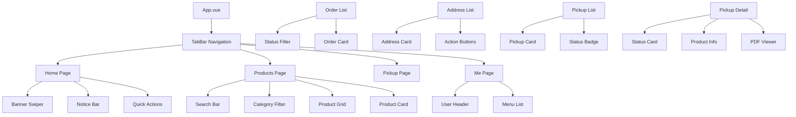
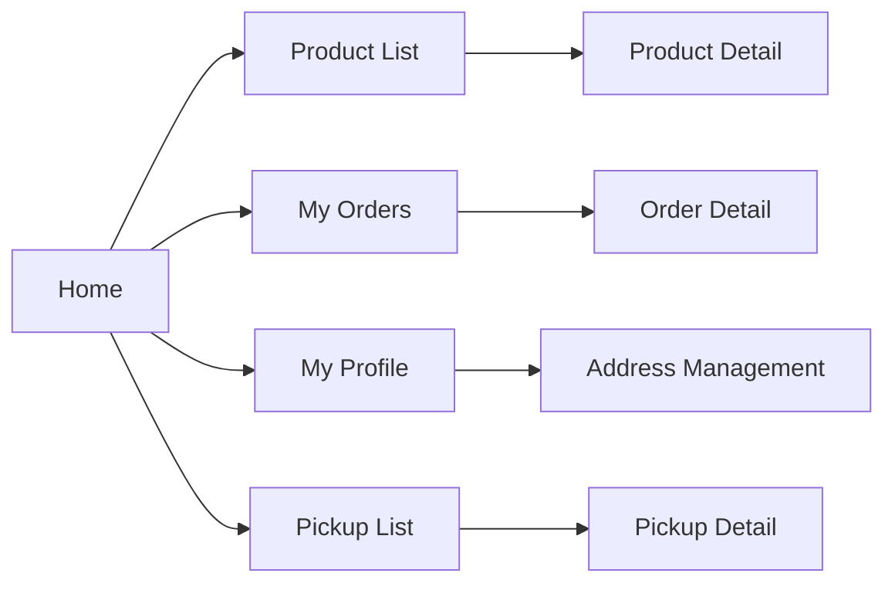

# Simple Shop Pages Implementation Design

## Overview

This project is a uni-app based mobile e-commerce application built with Vue 3, TypeScript, Vite, and UnoCSS. The application features a tabbar-based navigation system and implements a complete shopping experience including home, product browsing, order management, address management, and package pickup functionality.

Based on the UI/UX mockup provided, we need to implement 8 main pages that cover the core e-commerce functionality with existing UnoCSS styling framework and mock API integration.

## Technology Stack & Dependencies

- **Framework**: uni-app with Vue 3 + TypeScript
- **Build Tool**: Vite 5
- **Styling**: UnoCSS with custom presets
- **UI Library**: sard-uniapp, wot-design-uni
- **State Management**: Pinia with persistence
- **HTTP Client**: Custom uni-app HTTP wrapper
- **Icons**: uni-icons, Carbon icons via UnoCSS

## Component Architecture

### Page Structure Hierarchy

```
src/pages/
├── index/                    # Home page (already exists)
│   └── index.vue
├── products/                 # Product related pages
│   ├── list.vue             # Product list page
│   └── detail.vue           # Product detail page
├── orders/                   # Order management
│   └── list.vue             # Order list page
├── address/                  # Address management
│   └── list.vue             # Address list page
├── pickup/                   # Package pickup
│   ├── list.vue             # Pickup list page
│   └── detail.vue           # Pickup detail page
└── me/                       # User profile (already exists)
    └── me.vue
```

### Component Hierarchy



## Routing & Navigation

### TabBar Configuration Update

Update `src/tabbar/config.ts` to include the shopping functionality:

```typescript
export const customTabbarList: CustomTabBarItem[] = [
  {
    text: '首页',
    pagePath: 'pages/index/index',
    iconType: 'uniUi',
    icon: 'home',
  },
  {
    text: '商品',
    pagePath: 'pages/products/list',
    iconType: 'uniUi',
    icon: 'shop',
  },
  {
    text: '取件',
    pagePath: 'pages/pickup/list',
    iconType: 'uniUi',
    icon: 'delivery',
  },
  {
    text: '我的',
    pagePath: 'pages/me/me',
    iconType: 'uniUi',
    icon: 'contact',
  },
]
```

### Navigation Flow



## Styling Strategy

### UnoCSS Utility Classes

The project uses UnoCSS with custom presets for uni-app compatibility. Key styling patterns:

- **Layout**: `flex`, `grid`, `center` (custom shortcut)
- **Spacing**: `p-4`, `m-4`, `space-x-2`
- **Colors**: `text-gray-600`, `bg-blue-500`, `text-primary`
- **Typography**: `text-sm`, `font-medium`, `text-2xs` (custom)
- **Responsive**: `w-full`, `h-32`, `max-w-100`

### Component Styling Patterns

``scss
// Common card styling
.card-base {
  @apply bg-white border border-gray-200 rounded-lg p-4;
}

// Product grid layout
.product-grid {
  @apply grid grid-cols-2 gap-4 p-4;
}

// Status badge variants
.status-pending {
  @apply bg-orange-100 text-orange-600 px-2 py-1 rounded text-xs;
}

.status-completed {
  @apply bg-green-100 text-green-600 px-2 py-1 rounded text-xs;
}
```

## State Management

### Store Structure

```typescript
// stores/banner.ts
interface BannerState {
  banners: Banner[]
  loading: boolean
}

// stores/notice.ts  
interface NoticeState {
  notice: Notice | null
  loading: boolean
}

// stores/products.ts
interface ProductState {
  products: Product[]
  categories: Category[]
  currentCategory: string
  loading: boolean
}

// stores/orders.ts
interface OrderState {
  orders: Order[]
  currentStatus: OrderStatus
  loading: boolean
}

// stores/address.ts
interface AddressState {
  addresses: Address[]
  defaultAddress: Address | null
}

// stores/pickup.ts
interface PickupState {
  pickups: Pickup[]
  currentStatus: PickupStatus
  loading: boolean
}
```

## API Integration Layer

### Service Layer Architecture

```typescript
// services/banner.ts
export class BannerService {
  static async getBanners(): Promise<Banner[]> {
    const response = await http.get<Banner[]>('https://www.anahaimu.store/api/v2/slide/getall')
    return response.data
  }
}

// services/notice.ts  
export class NoticeService {
  static async getNotice(): Promise<Notice> {
    const response = await http.get<Notice>('https://www.anahaimu.store/api/v2/notice/info')
    return response.data
  }
}

// services/products.ts
export class ProductService {
  static async getProducts(params?: ProductQueryParams): Promise<Product[]> {
    // Mock implementation with local data
    return mockProducts
  }
  
  static async getProductDetail(id: string): Promise<Product> {
    return mockProductDetail
  }
}
```

### Data Models & ORM Mapping

```typescript
// types/banner.ts
export interface Banner {
  id: string
  image: string
  title: string
  subtitle?: string
  link?: string
  order: number
}

// types/notice.ts
export interface Notice {
  id: string
  content: string
  type: 'info' | 'warning' | 'error'
  isActive: boolean
}

// types/product.ts
export interface Product {
  id: string
  name: string
  description: string
  price: number
  originalPrice?: number
  image: string
  images: string[]
  category: string
  stock: number
  sales: number
  variants?: ProductVariant[]
}

// types/order.ts
export interface Order {
  id: string
  orderNo: string
  status: OrderStatus
  items: OrderItem[]
  totalAmount: number
  createTime: string
  payTime?: string
}

// types/address.ts
export interface Address {
  id: string
  name: string
  phone: string
  province: string
  city: string
  district: string
  detail: string
  isDefault: boolean
}

// types/pickup.ts
export interface Pickup {
  id: string
  productName: string
  productImage: string
  status: PickupStatus
  createTime: string
  expireTime: string
  documents?: PickupDocument[]
}
```

## Business Logic Layer

### Home Page Architecture

```typescript
// composables/useHomePage.ts
export function useHomePage() {
  const bannerStore = useBannerStore()
  const noticeStore = useNoticeStore()
  
  const loadData = async () => {
    await Promise.all([
      bannerStore.fetchBanners(),
      noticeStore.fetchNotice()
    ])
  }
  
  const handleQuickAction = (action: QuickAction) => {
    switch (action) {
      case 'products':
        uni.switchTab({ url: '/pages/products/list' })
        break
      case 'pickup':
        uni.switchTab({ url: '/pages/pickup/list' })
        break
      case 'orders':
        uni.navigateTo({ url: '/pages/orders/list' })
        break
      case 'profile':
        uni.switchTab({ url: '/pages/me/me' })
        break
    }
  }
  
  return {
    banners: computed(() => bannerStore.banners),
    notice: computed(() => noticeStore.notice),
    loading: computed(() => bannerStore.loading || noticeStore.loading),
    loadData,
    handleQuickAction
  }
}
```

### Product List Architecture

```typescript
// composables/useProductList.ts
export function useProductList() {
  const productStore = useProductStore()
  const searchKeyword = ref('')
  const currentCategory = ref('all')
  
  const filteredProducts = computed(() => {
    return productStore.products.filter(product => {
      const matchKeyword = !searchKeyword.value || 
        product.name.includes(searchKeyword.value)
      const matchCategory = currentCategory.value === 'all' || 
        product.category === currentCategory.value
      return matchKeyword && matchCategory
    })
  })
  
  const handleSearch = useDebounceFn((keyword: string) => {
    searchKeyword.value = keyword
  }, 300)
  
  const handleCategoryChange = (category: string) => {
    currentCategory.value = category
  }
  
  const handleProductClick = (product: Product) => {
    uni.navigateTo({
      url: `/pages/products/detail?id=${product.id}`
    })
  }
  
  return {
    products: filteredProducts,
    categories: computed(() => productStore.categories),
    currentCategory,
    searchKeyword,
    loading: computed(() => productStore.loading),
    handleSearch,
    handleCategoryChange,
    handleProductClick
  }
}
```

### Order Management Architecture

```typescript
// composables/useOrderList.ts
export function useOrderList() {
  const orderStore = useOrderStore()
  const currentStatus = ref<OrderStatus>('all')
  
  const filteredOrders = computed(() => {
    if (currentStatus.value === 'all') {
      return orderStore.orders
    }
    return orderStore.orders.filter(order => order.status === currentStatus.value)
  })
  
  const handleStatusChange = (status: OrderStatus) => {
    currentStatus.value = status
  }
  
  const handleOrderAction = (order: Order, action: OrderAction) => {
    switch (action) {
      case 'pay':
        handlePayOrder(order)
        break
      case 'cancel':
        handleCancelOrder(order)
        break
      case 'view':
        uni.navigateTo({ url: `/pages/orders/detail?id=${order.id}` })
        break
    }
  }
  
  return {
    orders: filteredOrders,
    currentStatus,
    loading: computed(() => orderStore.loading),
    handleStatusChange,
    handleOrderAction
  }
}
```

## Middleware & Interceptors

### Authentication Middleware

```typescript
// middleware/auth.ts
export function setupAuthMiddleware() {
  // Page navigation interceptor
  const authPages = ['/pages/orders/list', '/pages/address/list', '/pages/pickup/list']
  
  uni.addInterceptor('navigateTo', {
    invoke(args) {
      if (authPages.some(page => args.url.includes(page))) {
        const tokenStore = useTokenStore()
        if (!tokenStore.isLoggedIn) {
          uni.showToast({
            title: '请先登录',
            icon: 'none'
          })
          uni.navigateTo({ url: '/pages/login/login' })
          return false
        }
      }
      return true
    }
  })
}
```

### Request Interceptor Enhancement

```typescript
// http/interceptor.ts
export function setupHttpInterceptors() {
  // Request interceptor
  http.interceptors.request.use((config) => {
    // Add base URL for mock APIs
    if (config.url.startsWith('/api/v2/')) {
      config.url = `https://www.anahaimu.store${config.url}`
    }
    
    // Add auth token
    const tokenStore = useTokenStore()
    if (tokenStore.token) {
      config.header = {
        ...config.header,
        Authorization: `Bearer ${tokenStore.token}`
      }
    }
    
    return config
  })
  
  // Response interceptor
  http.interceptors.response.use(
    (response) => response,
    (error) => {
      // Handle network errors
      if (!navigator.onLine) {
        uni.showToast({
          title: '网络连接异常',
          icon: 'none'
        })
      }
      return Promise.reject(error)
    }
  )
}
```

## Testing

### Unit Testing Strategy

```typescript
// tests/composables/useHomePage.test.ts
describe('useHomePage', () => {
  it('should load banner and notice data', async () => {
    const { loadData, banners, notice, loading } = useHomePage()
    
    expect(loading.value).toBe(false)
    
    await loadData()
    
    expect(banners.value).toHaveLength(3)
    expect(notice.value).toBeDefined()
  })
  
  it('should handle quick actions correctly', () => {
    const { handleQuickAction } = useHomePage()
    const navigateSpy = vi.spyOn(uni, 'switchTab')
    
    handleQuickAction('products')
    
    expect(navigateSpy).toHaveBeenCalledWith({
      url: '/pages/products/list'
    })
  })
})

// tests/stores/products.test.ts
describe('ProductStore', () => {
  it('should fetch products successfully', async () => {
    const store = useProductStore()
    
    await store.fetchProducts()
    
    expect(store.products).toHaveLength(4)
    expect(store.loading).toBe(false)
  })
  
  it('should filter products by category', () => {
    const store = useProductStore()
    store.products = mockProducts
    
    const digitalProducts = store.getProductsByCategory('digital')
    
    expect(digitalProducts).toHaveLength(2)
  })
})
```

### Component Testing Examples

```typescript
// tests/components/ProductCard.test.ts
describe('ProductCard', () => {
  it('should render product information correctly', () => {
    const product = mockProduct
    const wrapper = mount(ProductCard, {
      props: { product }
    })
    
    expect(wrapper.find('.product-name').text()).toBe(product.name)
    expect(wrapper.find('.product-price').text()).toContain('¥299')
    expect(wrapper.find('image').attributes('src')).toBe(product.image)
  })
  
  it('should emit click event when card is clicked', async () => {
    const wrapper = mount(ProductCard, {
      props: { product: mockProduct }
    })
    
    await wrapper.trigger('click')
    
    expect(wrapper.emitted('click')).toBeTruthy()
    expect(wrapper.emitted('click')[0]).toEqual([mockProduct])
  })
})
```

### Page Testing Strategy

```typescript
// tests/pages/products/list.test.ts
describe('Product List Page', () => {
  it('should display products in grid layout', async () => {
    const wrapper = mount(ProductListPage)
    await flushPromises()
    
    expect(wrapper.findAll('.product-card')).toHaveLength(4)
    expect(wrapper.find('.product-grid')).toBeTruthy()
  })
  
  it('should filter products by search keyword', async () => {
    const wrapper = mount(ProductListPage)
    const searchInput = wrapper.find('input[placeholder="搜索商品..."]')
    
    await searchInput.setValue('耳机')
    await flushPromises()
    
    expect(wrapper.findAll('.product-card')).toHaveLength(1)
  })
  
  it('should filter products by category', async () => {
    const wrapper = mount(ProductListPage)
    const digitalTab = wrapper.find('[data-category="digital"]')
    
    await digitalTab.trigger('click')
    await flushPromises()
    
    expect(wrapper.findAll('.product-card')).toHaveLength(2)
  })
})
```

### Mock Data Setup

```typescript
// tests/mocks/api.ts
export const mockBanners: Banner[] = [
  {
    id: '1',
    image: 'https://images.unsplash.com/photo-1441986300917-64674bd600d8',
    title: '精选好物',
    subtitle: '发现生活之美',
    order: 1
  }
]

export const mockNotice: Notice = {
  id: '1',
  content: '新用户注册即享8折优惠',
  type: 'info',
  isActive: true
}

export const mockProducts: Product[] = [
  {
    id: '1',
    name: '无线蓝牙耳机',
    description: '高品质音响效果',
    price: 299,
    originalPrice: 399,
    image: 'https://images.unsplash.com/photo-1523275335684-37898b6baf30',
    images: ['https://images.unsplash.com/photo-1523275335684-37898b6baf30'],
    category: 'digital',
    stock: 100,
    sales: 1234
  }
]
```

### Integration Testing

```typescript
// tests/integration/shopping-flow.test.ts
describe('Shopping Flow Integration', () => {
  it('should complete full shopping flow', async () => {
    // 1. Navigate to product list
    await wrapper.find('[data-action="products"]').trigger('click')
    expect(mockRouter.push).toHaveBeenCalledWith('/pages/products/list')
    
    // 2. Select product
    await wrapper.find('.product-card').trigger('click')
    expect(mockRouter.push).toHaveBeenCalledWith('/pages/products/detail?id=1')
    
    // 3. Add to cart (mock)
    await wrapper.find('.add-to-cart').trigger('click')
    expect(wrapper.find('.cart-badge').text()).toBe('1')
    
    // 4. Navigate to orders
    await wrapper.find('[data-action="orders"]').trigger('click')
    expect(mockRouter.push).toHaveBeenCalledWith('/pages/orders/list')
  })
})


