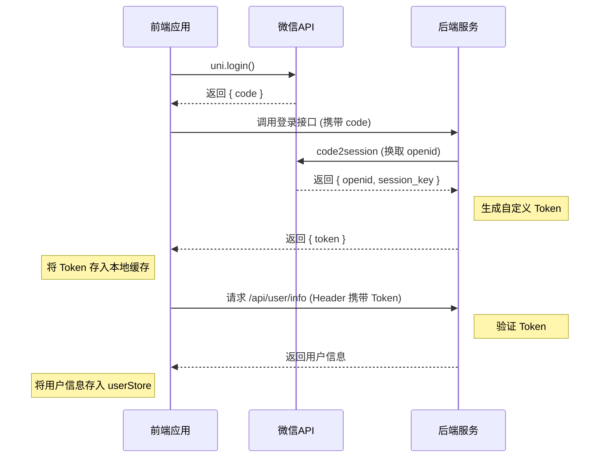
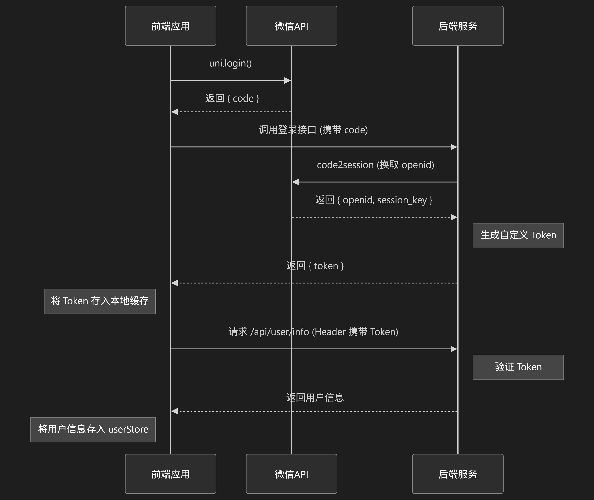

好的，我们来梳理一下 `login token` 的相关流程。

根据您提供的代码和项目结构，`login token` 的获取和管理并非在 `userStore` 中直接进行，而是由项目底层的请求库（通常封装在 `utils` 目录下）统一处理。`userStore` 的作用是在 `token` 已经存在的前提下，去获取和管理业务上的用户信息。

结合 `userStore` 的行为和这类小程序的通用架构，我们可以推断出完整的 `login token` 流程。

### **Login Token 流程梳理**

整个流程可以分为三个主要阶段：静默登录获取Token、通过Token获取用户信息、更新用户信息（如授权手机号）。

#### **阶段一：应用初始化与静默登录**

这是用户无感知的过程，在应用启动时自动完成。

1.  **触发时机**：小程序冷启动或 `token` 失效时。
2.  **调用微信登录**：应用底层的请求封装会首先调用 `uni.login()`，从微信服务器获取一个临时的 `code`。
3.  **后端换取Token**：
    *   前端将获取到的 `code` 发送到应用后端的特定登录接口（例如 `/api/v1/login`）。
    *   后端服务收到 `code` 后，会结合自身的 `AppID` 和 `AppSecret`，请求微信的认证服务器，换取用户的 `openid` 和 `session_key`。
    *   后端根据 `openid` 在自己的数据库中查找或创建一个用户记录，并为此用户生成一个自定义的身份令牌（`token`，通常是 JWT 格式）。
4.  **前端存储Token**：
    *   后端将生成的 `token` 返回给前端。
    *   前端的请求库接收到 `token` 后，会通过 `uni.setStorageSync` 将其保存在本地缓存中。

#### **阶段二：获取用户信息**

当应用需要展示用户信息或进行需要登录的操作时，会执行此阶段。

1.  **自动附加Token**：当应用发起任何需要授权的API请求时（例如调用 `userStore` 中的 [`getUserInfo`](src/store/modules/user.ts:111)），请求拦截器会自动从本地缓存中读取 `token`。
2.  **请求头携带Token**：拦截器会将 `token` 放入请求的 `Header` 中，通常是 `Authorization: Bearer <your-token>`。
3.  **后端验证并返回数据**：后端收到请求后，会验证 `Header` 中的 `token` 是否有效。如果有效，就处理该请求，并返回对应的用户信息。
4.  **存入Pinia**：[`getUserInfo`](src/store/modules/user.ts:111) 方法拿到后端返回的用户数据后，会将其存入 `Pinia` 的 `wxInfo` state 中，供全局页面和组件使用。

#### **阶段三：授权手机号，完成绑定**

这是我们之前分析过的流程，它是在 `token` 已存在但用户信息不完整（缺少手机号）时进行的。

1.  **判断绑定状态**：通过 `userStore` 的计算属性 [`isBind`](src/store/modules/user.ts:54) 判断用户是否已绑定手机。
2.  **发起授权**：如果未绑定，UI会引导用户点击授权按钮。
3.  **更新手机号**：[`updateUserPhoneNumber`](src/store/modules/user.ts:75) 方法被调用，将微信返回的加密数据发送给后端。
4.  **刷新用户信息**：后端更新手机号成功后，前端会再次调用 [`updateUserInfo`](src/store/modules/user.ts:83) 来刷新 `Pinia` 中的用户信息，此时 `isBind` 变为 `true`。

### **流程图总结**

### **关键点**

*   **Token的抽象性**：`userStore` 本身不关心 `token` 的具体值和它如何来，它只负责发起业务请求。`token` 的管理被抽象到了更底层的请求层。
*   **无感登录**：整个 `token` 获取过程对用户是透明的，提升了用户体验。
*   **数据驱动**：一旦 `token` 获取成功，`userStore` 就会成为用户状态的单一数据源，驱动整个应用的UI和逻辑。
*   **容错与刷新**：虽然代码中未直接展示，但一个健全的请求库还会处理 `token` 过期的情况。当收到后端返回的 `401` 等状态码时，它会自动触发上述“阶段一”的静默登录流程，重新获取 `token` 并重试失败的请求。如果刷新失败，则会调用 [`clearInfo`](src/store/modules/user.ts:171) 清理用户信息并引导用户重新授权。